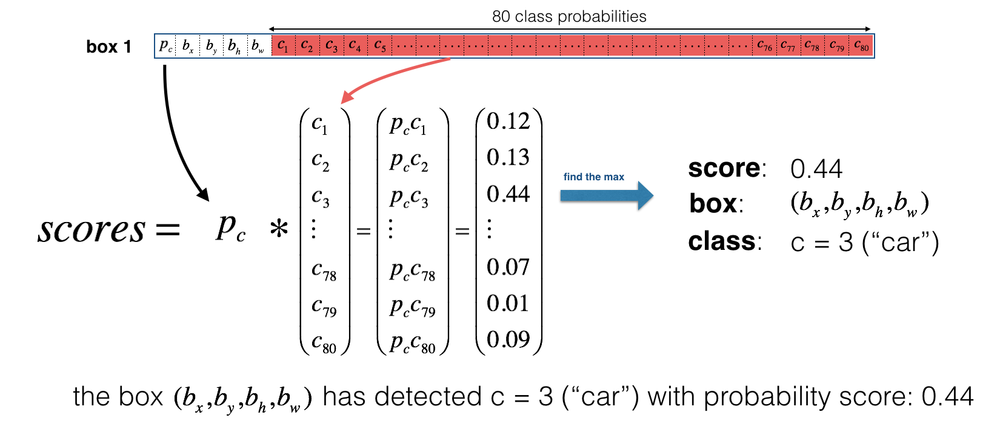

# Autonomous-Car-Detection-YOLO
A simple car detection system utilizing YOLO algorithm using data from a camera mounted on the hood of a car, which takes pictures of the road ahead every few seconds while driving. 
"You Only Look Once" (YOLO) is a popular algorithm because it achieves high accuracy while also being able to run in real-time. This algorithm "only looks once" at the image in the sense that it requires only one forward propagation pass through the network to make predictions. After non-max suppression, it then outputs recognized objects together with the bounding boxes.

https://user-images.githubusercontent.com/5472711/109359128-89d0af00-784a-11eb-8bec-132aeb3a89cf.mp4

# How does YOLO work? 

1. It uses a Deep CNN that takes an input image of m X 608 X 608 X 3 and returns 19 x 19 x 5 x 85 volume, where m is the number of training samples.

2. Flatten the last two dimensions, 5 anchor boxes and 85 boxes (1 confidence probability, 4 bounding boxes [x, y, h, w] and 80 classes) to output 19 x 19 x 425 volume

3. Compute the class Score given by 
$score_{c,i} = p_{c} \times c_{i}$: the probability that there is an object $p_{c}$ times the probability that the object is a certain class $c_{i}$.

4. Selecting the predicted boxes

**Score-Thresholding**: 
Apply a threshold over the computed scores for each grid and discard the detected boxes that did not meet the threshold

**Non-Max Suppression**:
Even after score thresholding, we could end up with a lot of overlapping boxes for each grid. Non-max supression filtering can be used to get rid of  these boxes by removing the ones that do not meet Intersection over Union (criteria) threshold

5. Visualizing the predictions

This shows the predicted class for each of the 19 x 19 grid, based on the maximum probablities takes from the 80 classes over 5 anchor boxes

## Depedencies

The execution environment is specified in the requirements.txt

## To generate yolo.h5 from YAD2K repository

1. Clone the YAD2K repo
2. Download the yolo.weights file from [here]( http://pjreddie.com/media/files/yolo.weights)
3. Download the v2 config from [here]( https://github.com/pjreddie/darknet/blob/master/cfg/yolov2.cfg)
4. Create the YAD2K env locally. (conda env create -f environment.yml) 
If step 4 does not work, install packages manually using instructions in YAD2K repo
5. To generate the yolo.h5 file, run the command: `python yad2k.py yolo.cfg yolo.weights model_data/yolo.h5`

# Results

Found 7 boxes for test.jpg
car 0.60 (925, 285) (1045, 374)
car 0.66 (706, 279) (786, 350)
bus 0.67 (5, 266) (220, 407)
car 0.70 (947, 324) (1280, 705)
car 0.74 (159, 303) (346, 440)
car 0.80 (761, 282) (942, 412)
car 0.89 (367, 300) (745, 648)

## References 

- Joseph Redmon, Santosh Divvala, Ross Girshick, Ali Farhadi - [You Only Look Once: Unified, Real-Time Object Detection](https://arxiv.org/abs/1506.02640) (2015)
- Joseph Redmon, Ali Farhadi - [YOLO9000: Better, Faster, Stronger](https://arxiv.org/abs/1612.08242) (2016)
- Allan Zelener - [YAD2K: Yet Another Darknet 2 Keras](https://github.com/allanzelener/YAD2K)
- The official YOLO website (https://pjreddie.com/darknet/yolo/) 
- Convolutional Neural Networks, Deep learning Specialization by Deeplearning.AI : https://www.coursera.org/learn/convolutional-neural-networks
* [YAD2K repository](https://github.com/allanzelener/YAD2K)
* [yolov2 official website](https://pjreddie.com/darknet/yolov2/)
* [yolov3 official website](https://pjreddie.com/darknet/yolo/)
* [darknet repository - will all configs]( https://github.com/pjreddie/darknet/tree/master/cfg)

opensource threads related to this:
* (https://github.com/JudasDie/deeplearning.ai/issues/2)
* (https://github.com/allanzelener/YAD2K/issues/57) 
